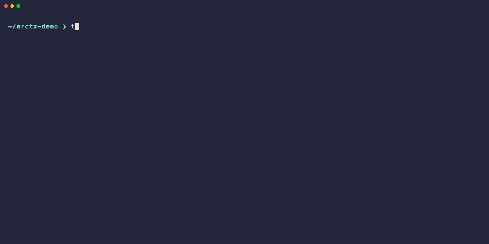

# ARCTX

> **Git は「何が変わったか」を追う。ARCTX は「なぜ変えたか」と「なぜやめたか」を追う。**
>
> Append-only DAG for reasoning history, parallel agent collaboration, and abandoned branches that stay in the graph.

## パッケージ構成

このリポジトリは 3 つのパッケージを配布します：

| パッケージ | インストール | インポート | 用途 |
|-----------|------------|----------|------|
| `arctx` | `pip install arctx` | `import arctx` | コア API・ストレージ・拡張 (CLI/TUI 依存なし) |
| `arctx-cli` | `pip install arctx-cli` | `import arctx_cli` | `arctx` コマンド・argparse CLI |
| `arctx-tui` | `pip install arctx-tui` | `import arctx_tui` | `arctx-tui` コマンド・Textual TUI |

`arctx-cli` と `arctx-tui` はそれぞれ `arctx` に依存しますが、互いには依存しません。必要なものだけインストールしてください。

```python
import arctx

handle = arctx.init(arctx.Requirement(requirement_id="r", target_type="code", target_id="r"))
```

---

ARCTX は agent framework / planner / executor ではありません。
それらの下に置かれる graph layer です。



*2つの AI agent (Claude と Codex) が同じ run に対して並列に作業している様子。それぞれが独立した `work-session` を持ち、両方の branch は同じ `RunGraph` 内の sibling transition として記録されます。race condition も上書きも発生しません。*


*インタラクティブな 3-pane TUI で DAG を歩く: 各 attempt、revert、payload の diff、git の履歴が 1 画面で見渡せます。*

> 0.2 beta — コアグラフモデルは安定化に向かっています。ストレージや API の変更はまだ起こる可能性がありますが、リリースノートで説明します。

*English version: see [README.md](README.md).*

---

## なぜ ARCTX か

実際の作業は一直線ではありません。仮説を立てる → 試す → 結果を観測する → ある分岐を捨てる → 別の分岐を採る — そして後から「なぜその道を通ったのか」を辿る必要が出てきます。

- Git は **ファイル履歴** — どの commit でどのバイトが変わったか。
- ARCTX は **reasoning / action / decision の履歴** — どの仮説を試し、どんな結果が出て、どの分岐を切ったか。

ARCTX はそれら全てを 1 つの append-only DAG として記録します:

- **並列 agent でも衝突しない。** 複数の agent や人間が同じ run を駆動できます。各々独立した work-session を持ち、attempt は sibling transition として並びます。
- **revert しても履歴は残る。** 失敗した書き換えは削除されず、`CutPayload` で inactive とマークされます。何を試したか・なぜ捨てたかをあとから辿れます。
- **commit だけでなく domain payload を載せられる。** benchmark 結果、予測、意図 — 何でも attach できます。各 transition が「何のため」だったかを DAG が知っています。
- **active かどうかは read-time に計算。** 切り捨てた branch は自動で filter されます。履歴を書き換えずに、グラフは綺麗に保たれます。

ARCTX は executor / planner / agent framework ではありません。それらが「何をしたか・なぜそうしたか」を保存するための基盤です。

---

## どんな時に使うか

- **複数 AI agent / 人間によるソフトウェア作業** — Claude Code、Codex、自作 agent や人間が同じ codebase で作業する場合。各試行が区別され、あとからレビュー可能になります。
- **研究・設計探索** — 仮説を branch させ、結果を payload で残し、捨てた分岐も証拠として保持します。
- **調査・デバッグ** — 仮説と観察結果を payload で記録し、原因にたどり着いた時点で trace を逆向きに歩けます。
- **ベンチマーク駆動の開発** — 「variant A を試す / variant B を試す」が、計測値が attach された transition として記録されます。
- **kernel / 数値最適化** — 上記の一具体例。tiled / vectorize / fuse の試行が sibling transition になり、revert / merge は first-class。

---

### 具体例 1: ベンチマーク駆動最適化

variant A を試す → 遅くなる。variant B を試す → 速くなる。3 ヶ月後「なぜ A を捨てたのか」を説明する必要が出てきた。

```bash
# 1. ベースライン
arctx init optimize --extension git --run-id bench
arctx git commit -m "baseline: naive loop"

# 2. 仮説 A — キャッシュ層を追加
git checkout -b feat/cache
# ...編集...
git add . && arctx git commit -m "add cache (仮説 A)"
arctx payload add --target transition:latest \
  --payload-type benchmark \
  --field elapsed_ms=1200 \
  --field note="baseline より遅い"

# 3. A を破棄 — グラフから消えない、ただ inactive マークがつく
arctx cut transition $(arctx show --latest transition)

# 4. 仮説 B — ベクトル化
git checkout main && git checkout -b feat/vectorize
# ...編集...
git add . && arctx git commit -m "vectorize (仮説 B)"
arctx payload add --target transition:latest \
  --payload-type benchmark \
  --field elapsed_ms=180 \
  --field note="baseline の 5 倍速"
```

結果として出てくる graph は、すべての経緯を語ります：

```text
n_root
└─ t_baseline ── n_1
   ├─ t_cache_hypothesis_A ── n_2 ✂
   │     payload: benchmark {elapsed_ms: 1200, note: "baseline より遅い"}
   └─ t_vectorize_hypothesis_B ── n_3
         payload: benchmark {elapsed_ms: 180, note: "baseline の 5 倍速"}
```

スプレッドシートも、古びた Confluence ページも不要 — *推論* は *コード* の隣に生き続けます。

---

### 具体例 2: マルチエージェント並列作業

Claude と Codex が同じ run を、お互いを踏み合わずに進めます。

```bash
# 端末 1 — Claude
eval $(arctx work-session env --run demo --new --user claude)
git checkout -b claude/vec
# ...編集...
git add . && arctx git commit -m "Claude: vectorize inner loop"

# 端末 2 — Codex (同時に動いていてよい)
eval $(arctx work-session env --run demo --new --user codex)
git checkout main && git checkout -b codex/map
# ...編集...
git add . && arctx git commit -m "Codex: parallel map"
```

両方の attempt は同じ `RunGraph` の sibling transition として記録されます：

```text
n_root
└─ t_baseline ── n_1
   ├─ t_claude_vectorize_inner_loop ── n_2
   │     work-session: claude / ws_xxx
   └─ t_codex_parallel_map ── n_3
         work-session: codex / ws_yyy
```

グラフ内での merge conflict はありません。両方の attempt は永遠にレビュー可能です。

---

### 具体例 3: デバッグの trace

バグを追う間、すべての仮説を記録しておく。原因にたどり着いたら、trace を逆向きに歩けます。

```bash
arctx init debug --extension git --run-id bug-42
arctx git commit -m "reproduction script"

# 仮説: cache の race condition
git checkout -b try/race-fix
# ...編集...
arctx git commit -m "fix: add lock around cache"
arctx payload add --target transition:latest \
  --payload-type observation \
  --field result="まだ flaky"

# 仮説: index の off-by-one
git checkout main && git checkout -b try/index-fix
# ...編集...
arctx git commit -m "fix: correct loop bound"
arctx payload add --target transition:latest \
  --payload-type observation \
  --field result="バグ消滅 — 3 回連続 green"
```

```text
n_root
└─ t_reproduction_script ── n_1
   ├─ t_fix_add_lock_around_cache ── n_2
   │     payload: observation {result: "まだ flaky"}
   └─ t_fix_correct_loop_bound ── n_3
         payload: observation {result: "バグ消滅 — 3 回連続 green"}
```

「なぜ loop bound だと分かったのか」と聞かれたら、graph が代わりに答えます。

---

## 30 秒で始める

git repository の中で実行してください:

```bash
pip install -e .

arctx init my_task --extension git --run-id demo
echo "def f(): pass" > work.py && git add work.py
arctx git commit -m "baseline"

arctx-tui                              # DAG をインタラクティブに探索 (arctx-tui が必要)
arctx graph dump --format outline      # もしくは LLM 向け outline でダンプ
```

`arctx dump` は `arctx graph dump` の互換ショートカットとして残されています。

同じ repo で 2 つの agent を並列に動かしたい場合、それぞれに独立した work-session を発行できます:

```bash
# Claude の端末
eval $(arctx work-session env --run demo --new --user claude)
git checkout -b claude/vec
# ...編集...
git add . && arctx git commit -m "Claude: vectorization"

# Codex の端末 (同時に動いていてよい)
eval $(arctx work-session env --run demo --new --user codex)
git checkout main && git checkout -b codex/map
# ...編集...
git add . && arctx git commit -m "Codex: parallel map"
```

両方の branch は同じ `RunGraph` 内の sibling transition として記録されます。実際に動く VHS デモは `examples/demo_cli.tape` と `examples/demo_env.sh` を参照してください。

> **分離スコープの注意。** ARCTX の `work-session` が分離するのは run / session の履歴・actor attribution (誰がどの session で何をしたか) です。Git の working tree 自体は work-session だけでは分離しません — 上記の 2 端末は同じチェックアウトを共有します。各 session を個別の `git worktree` に紐付けたい場合は次の節を参照してください。

### 別々の worktree で並列に動かす

`arctx` は work-session 単位で git worktree を割り当てることができます。
これにより、複数 agent が編集・stage・commit を踏み合わずに進められます:

```bash
# 2 つの worktree を独立した branch で作る。
arctx git worktree add ../wt-claude claude/vec
arctx git worktree add ../wt-codex  codex/map

# 各 agent の work-session を worktree に紐付ける。
# ARCTX_RUN_ID / ARCTX_WORK_SESSION_ID / ARCTX_USER_ID に加えて
# ARCTX_GIT_WORKTREE が export され、以降の `arctx git commit` は
# その worktree 内でのみ実行される。
eval $(arctx work-session env --run demo --new --user claude \
        --worktree ../wt-claude)
eval $(arctx work-session env --run demo --new --user codex \
        --worktree ../wt-codex)
```

両 agent の commit は同じ `RunGraph` の sibling transition として記録され、
worktree はあくまで物理的なチェックアウトを分けるだけです。

---

## 概念 (1 画面)

ARCTX の中心は **`RunGraph`** — append-only な DAG です。pure な graph 記録は domain data を持たず、domain 固有の情報はすべて **Payload** 側に集約されます。

```text
RunGraph
  ├── Node         ← pure な DAG node
  ├── Transition   ← N 個の input node → 1 個の output node
  ├── Payload      ← Node または Transition に attach する注釈
  └── GraphView    ← 軽量な named scope (root_node_id のみ保持)
```

- 各 **attempt / experiment / action は transition として記録され**、その結果状態が output node になります。
- `NodePayload` / `TransitionPayload` — 汎用の注釈。`type` 文字列で目的を区別します。
- `CutPayload` — append-only な無効化マーカー。対象は削除されず、read-time に filter されます。
- `GitChangePayload` — `git` extension が `arctx git commit` のたびに attach する payload。

「この node はまだ生きているか」という activity 判定は、read 時に `RunGraph` と CutPayload から計算されます。store は決して書き換えません。

---

## CLI の主なコマンド

| コマンド | 用途 |
| --- | --- |
| `arctx init <req-id>` | 新しい run を作成。`--extension git` で git 統合を有効化。 |
| `arctx git commit -m ...` | 実際の `git commit` を実行し、`Transition` と `GitChangePayload` を記録。 |
| `arctx work-session env --new --user <name>` | 端末/サブプロセス専用のシェル exports を出力。`--worktree PATH` を付けると git 操作も指定 worktree に固定される。 |
| `arctx git worktree add <path> [branch]` | `git worktree add` の薄いラッパ。`work-session env --worktree` と組み合わせて、agent ごとに独立したチェックアウトを与える。 |
| `arctx transition create` | git なしで transition を追加。 |
| `arctx payload add` | 既存 Node / Transition に payload を attach。 |
| `arctx graph dump --format outline` | LLM 向けの indented spanning-tree でダンプ。 |
| `arctx graph dump --format mermaid` | 人間/ドキュメント向け Mermaid flowchart。 |
| `arctx-tui` | 3-pane (Runs / Flowchart / Detail) のインタラクティブ TUI。`pip install arctx-tui` で追加。 |
| `arctx cut node <id>` | Node (とその下流) を inactive に。append-only。 |
| `arctx guide` | 概念をインタラクティブに学ぶ (`--lang ja` で日本語)。 |

`arctx dump ...` は `arctx graph dump ...` の互換ショートカットとして残されています。

詳細リファレンス: [docs/ja/CLI.md](docs/ja/CLI.md)。

mutating コマンドの run 解決順は `--run` → `ARCTX_RUN_ID` 環境変数 → カレント git repo の `.arctx-id`。user attribution は `--user` → `ARCTX_USER_ID` → `<ARCTX_HOME>/config.json` → `"user"`。

---

## Python API

```python
import arctx as arctx
from arctx import NodePayload, Requirement, TransitionPayload
from arctx.storage import JsonlRunStore

requirement = Requirement(
    requirement_id="req_demo",
    target_type="task",
    target_id="explore_idea",
)

run = arctx.init(requirement, run_id="demo")

transition = run.transition(
    [run.root_node_id],
    TransitionPayload(
        payload_id="pending",
        target_id="pending",
        type="experiment",
        content={"intent": "最初の仮説を試す"},
    ),
)

run.attach(
    transition.output_node_id,
    NodePayload(
        payload_id="pending",
        target_id="pending",
        type="result",
        content={"observation": "promising", "status": "completed"},
    ),
)

history = run.trace(transition.output_node_id)

store = JsonlRunStore("runs")
run.save(store)
loaded = store.load_run("demo")
```

部分集合を切り出して探索したい場合は `GraphView` を作成します。`GraphView` は `root_node_id` のみを保持し、内容は read 時に `RunGraph.reachable_from(root_node_id)` で導出されます。

---

## インストール

Python 3.10 以上が必要です。

```bash
python3 -m pip install -e .            # editable install
python3 -m pip install -e ".[dev]"     # + 開発依存

# インストールせずに repo root から実行する場合:
PYTHONPATH=src python3 -m arctx_cli.main ...
```

---

## ストレージレイアウト

`JsonlRunStore` は run を以下のディレクトリ構造で保存します:

```text
<store-dir>/<run-id>/
  run.json
  graph.json
  nodes.jsonl
  transitions.jsonl
  payloads.jsonl
  views.jsonl
  work_sessions.jsonl
  work_events.jsonl
```

`SqliteRunStore` は同じ内容を per-run の `run.db` 1 ファイルにまとめます。デフォルトの store ディレクトリは `<ARCTX_HOME>/runs`。

0.2.x シリーズではストレージ形式の互換性を維持します。破壊的変更が必要な場合は、移行手順をリリースノートに明記します。

---

## ドキュメント

- [コンセプト](docs/ja/CONCEPT.md)
- [プロジェクトの方向性](docs/ja/DIRECTION.md)
- [State モデル](docs/ja/STATE_MODEL.md)
- [API](docs/ja/API.md)
- [CLI](docs/ja/CLI.md)
- [問題解決ループ](docs/ja/AGENT_LOOP.md)

English docs: see [docs/en/](docs/en/).

---

## 開発

```bash
PYTHONDONTWRITEBYTECODE=1 PYTHONPATH=src python3 -m pytest tests -q
```

## リリース

maintainer 向けの release 手順は [CONTRIBUTING.md](CONTRIBUTING.md#release-process) にあります。

## License

MIT
