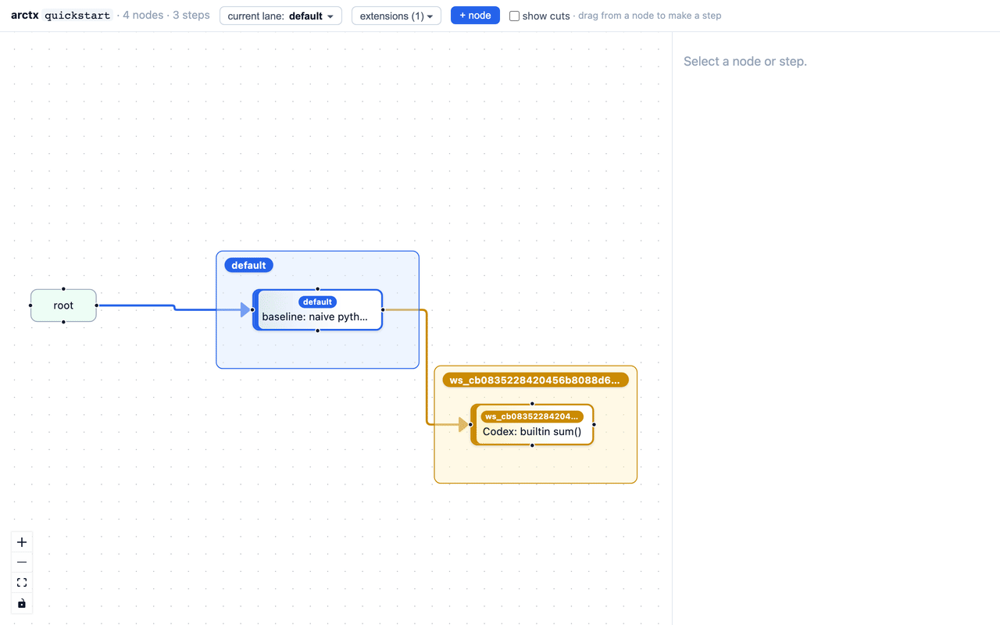
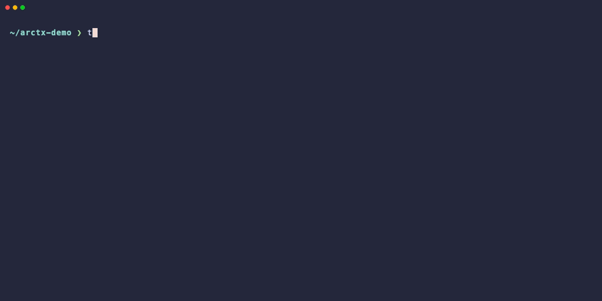

# ARCTX

<p align="center">
  <picture>
    <source media="(prefers-color-scheme: dark)" srcset="assets/arctx-mark-dark.svg">
    
  </picture>
</p>

[](https://github.com/takumiecd/arctx/actions/workflows/ci.yml)

> **ARCTX is an append-only experiment graph for hypotheses, trials, results, and abandoned branches.**
>
> Git tracks what changed. ARCTX tracks what was tried, why, what happened, and what survived.

**See it in 30 seconds** — one command spins up a throwaway repo where two
optimization hypotheses branch from one baseline, the slower dead end gets cut
*with its reason*, and the whole story exports as a shareable document:

```bash
git clone https://github.com/takumiecd/arctx && cd arctx
./examples/quickstart_demo.sh      # prints the graph + writes a shareable HTML
```



*What `quickstart_demo.sh` records: both hypotheses fan out from one baseline; the slower cache attempt is cut (✂) **with its reason** while the built-in `sum()` winner stays active — the whole decision survives in one graph. Toggle "show cuts" to reveal or hide the dead end.*

## Packages

The primary surface is two packages — **`arctx` (core) and `arctx-cli`**.

| Package | Install | Import | Purpose |
|---------|---------|--------|---------|
| `arctx` | `pip install arctx` | `import arctx` | Core API, storage, extensions (no CLI deps) |
| `arctx-cli` | `pip install arctx-cli` | `import arctx_cli` | `arctx` command, argparse CLI |

`arctx-cli` depends on `arctx`. For normal use, install `arctx-cli` (it pulls in `arctx`).

```python
import arctx

handle = arctx.init(arctx.Requirement(requirement_id="r", target_type="code", target_id="r"))
```

---

ARCTX is **not** an agent framework, planner, or executor.  
It is the graph layer for research, optimization, debugging, and agent work.



*Two AI agents (Claude and Codex) working against the same run in parallel. Each gets an isolated `lane`; both branches land as sibling steps in the same `RunGraph` — no race, no overwrite.*

> 0.4 beta — the DAG core (Node / Step / Payload) is stabilizing. Storage and API changes may still happen, but they will be documented in release notes.

*日本語版は [README.ja.md](README.ja.md) を参照してください。*

---

## Why ARCTX?

Research and optimization rarely move in a straight line. You form a
hypothesis, try it, observe what happened, drop one branch, take another, and
later need to reconstruct *why* you ended up where you did.

- Git is **file history** — what bytes changed in which commit.
- ARCTX is **experiment / reasoning / decision history** — which hypothesis was tested, which result it produced, and which branches were cut.

ARCTX records all of it as one append-only DAG:

- **Hypotheses become branches.** Competing trials can fan out from the same baseline instead of being flattened into a log.
- **Failed experiments stay useful.** A rejected branch is marked inactive via `CutPayload`, not deleted. You can still see what was tried, and why it was cut.
- **Domain payloads, not just commits.** Attach benchmark results, predictions, intent — anything. The DAG knows what each step was *for*.
- **Parallel agents, no conflict.** Several agents or humans can drive the same run; each gets its own tracked lane and their attempts become sibling steps.
- **Read-time activity.** Killed branches are filtered automatically; the graph stays clean without rewriting history.

ARCTX is *not* an executor, planner, or agent framework. It is the substrate for storing what was tried and why.

---

## When does ARCTX fit?

- **Research and design exploration** — branch hypotheses, capture results as payloads, keep dropped branches around as evidence.
- **Optimization work** — compare variants, keep baselines explicit, and preserve why a slower path was abandoned.
- **Benchmark-driven engineering** — every "try variant A, try variant B" lands as a step with its measurement attached.
- **Kernel / numeric optimization** — one specific case of the above: tiled / vectorized / fused experiments as sibling steps, with reverts and merges first-class.
- **Debugging and investigation** — record hypotheses and observations as payloads; walk the trace backwards when you finally find the bug.
- **Multi-agent software work** — Claude Code, Codex, custom agents and humans working on the same codebase. ARCTX keeps each attempt distinct and reviewable.

---

### Example 1: Benchmark-driven optimization

You try variant A, it gets slower. You try variant B, it gets faster. Three months later you need to explain *why* variant A was abandoned.

```bash
# 1. Baseline. Capture its node id so the experiments can branch off it.
arctx init optimize --extension git --run-id bench
echo "def f(): pass" > work.py && git add work.py
git commit -qm "baseline: naive loop"
BASE=$(arctx add --title "baseline: naive loop" --type commit --commit HEAD | jq -r .output_node_id)

# 2. Hypothesis A — add a cache layer, branched off the baseline node.
git checkout -b feat/cache
# ...edit...
git add .
git commit -qm "add cache (hypothesis A)"
A=$(arctx add --title "add cache (hypothesis A)" --type commit --commit HEAD --from "$BASE" | jq -r .output_node_id)
arctx attach "$A" --type benchmark \
  --json '{"elapsed_ms": 1200, "note": "slower than baseline"}'

# 3. Abandon A — it stays in the graph, just marked inactive, with a reason.
arctx cut "$A" --reason "slower than baseline"

# 4. Hypothesis B — vectorize, also branched off the same baseline node.
git checkout main && git checkout -b feat/vectorize
# ...edit...
git add .
git commit -qm "vectorize (hypothesis B)"
B=$(arctx add --title "vectorize (hypothesis B)" --type commit --commit HEAD --from "$BASE" | jq -r .output_node_id)
arctx attach "$B" --type benchmark \
  --json '{"elapsed_ms": 180, "note": "5x faster than baseline"}'
```

`--from "$BASE"` anchors both experiments to the baseline node, so they fan out as
true siblings (instead of chaining, where cutting A would also kill B). The
resulting graph tells the whole story — run `arctx export --format md --full-payloads`:

```text
n_root
└─ baseline ── n_baseline
   ├─ add cache (hypothesis A) ── n_A ✂
   │     benchmark {"elapsed_ms": 1200, "note": "slower than baseline"} · cut: slower than baseline
   └─ vectorize (hypothesis B) ── n_B
         benchmark {"elapsed_ms": 180, "note": "5x faster than baseline"}
```

No spreadsheet, no stale Confluence page — the *reasoning* lives next to the *code*.

---

### Example 2: Multi-agent parallel work

Claude and Codex drive the same run without stepping on each other.

```bash
# Shared baseline. Both agents branch their work off this node id.
git commit -qm "baseline"
BASE=$(arctx add --title "baseline" --type commit --commit HEAD --run demo | jq -r .output_node_id)

# Terminal 1 — Claude. Pin the run and a lane to this terminal only.
eval "$(arctx use demo --shell)"
arctx lane create claude --purpose "vectorize the inner loop" --user claude
eval "$(arctx lane switch claude --shell)"
export ARCTX_USER_ID=claude
git checkout -b claude/vec
# ...edits...
git add . && git commit -qm "Claude: vectorize inner loop"
arctx add --title "Claude: vectorize inner loop" --type commit --commit HEAD --from "$BASE"

# Terminal 2 — Codex (running at the same time)
eval "$(arctx use demo --shell)"
arctx lane create codex --purpose "parallel map" --user codex
eval "$(arctx lane switch codex --shell)"
export ARCTX_USER_ID=codex
git checkout main && git checkout -b codex/map
# ...edits...
git add . && git commit -qm "Codex: parallel map"
arctx add --title "Codex: parallel map" --type commit --commit HEAD --from "$BASE"
```

Both land in the same `RunGraph` as sibling steps off the baseline. Each
agent has its own lane, and `--from "$BASE"` keeps them independent —
no fast-forward conflict, no overwrite:

```text
n_root
└─ baseline ── n_baseline
   ├─ Claude: vectorize inner loop ── n_2   (lane: claude / ws_xxx)
   └─ Codex: parallel map           ── n_3   (lane: codex / ws_yyy)
```

No merge conflicts in the graph. Both attempts stay reviewable forever.

---

### Example 3: Debugging trace

Record every hypothesis as you chase a bug; walk it backwards once you find the cause.

```bash
arctx init debug --extension git --run-id bug-42
echo "# repro" > repro.py && git add repro.py
git commit -qm "reproduction script"
REPRO=$(arctx add --title "reproduction script" --type commit --commit HEAD | jq -r .output_node_id)

# Hypothesis: race condition in cache
git checkout -b try/race-fix
# ...edit...
git add .
git commit -qm "fix: add lock around cache"
R=$(arctx add --title "fix: add lock around cache" --type commit --commit HEAD --from "$REPRO" | jq -r .output_node_id)
arctx attach "$R" --type observation --json '{"result": "still flaky"}'

# Hypothesis: off-by-one in index
git checkout main && git checkout -b try/index-fix
# ...edit...
git add .
git commit -qm "fix: correct loop bound"
I=$(arctx add --title "fix: correct loop bound" --type commit --commit HEAD --from "$REPRO" | jq -r .output_node_id)
arctx attach "$I" --type observation --json '{"result": "bug gone - 3 runs green"}'
```

Both hypotheses branch off the reproduction node, so they stay independent and comparable:

```text
n_root
└─ reproduction script ── n_repro
   ├─ fix: add lock around cache ── n_2
   │     observation {"result": "still flaky"}
   └─ fix: correct loop bound    ── n_3
         observation {"result": "bug gone — 3 runs green"}
```

When your colleague asks *"how did you know it was the loop bound?"*, the graph answers for you.

---

### Example 4: One subject, two branches, one conclusion

A `lane` is a unit of work and a table is a bundle of numbers. A **topic** is a
bundle of *meaning*: tag any nodes or steps as belonging to a subject, from
anywhere in the graph, and read what they add up to.

```bash
arctx topic tag l2-tiling "$CLAUDE_RESULT"
arctx topic tag l2-tiling "$CODEX_RESULT"     # a record from the other branch
```

Connectivity is never required or validated. But the second tag notices that
the subject now spans two lineages that never met — and says so, with every way
out spelled as a runnable command:

```text
notice: topic "l2-tiling" spans 2 unjoined islands
  island 1  1 records  tip n_b003732a  (lane claude)
  island 2  1 records  tip n_8744ba41  (lane codex)
  both are right, under different conditions
    → arctx topic join l2-tiling --summary "..."
  they turned out to be two subjects
    → arctx topic split l2-tiling --island 2 --into NEW_NAME --summary "..."
  island 2 was a dead end
    → arctx cut n_8744ba41 --reason "..."
  the tag was a mistake
    → arctx topic untag l2-tiling n_8744ba41
```

A split subject is a contradiction you are carrying, and there are exactly four
ways out of it. Take one:

```bash
arctx topic join l2-tiling \
  --summary "128 tiles win on both branches; the map path just needed the same bound"
# joined 2 lineages of topic "l2-tiling" — 1 island now
```

The join is a real Step from every island's tip, so the verdict is a node that
comes *after* both — which is why `--summary` is required. It has no correct
side: the inputs are a set.

```bash
arctx topics
# l2-tiling  ·  3 records · 1 islands  ·  128 tiles win on both branches; ...
```

`arctx guide --context` prints the top statements and, deliberately, the topics
that are still split — the ones where you know two things that do not agree
yet. `arctx topic log <name>` walks the statement history, oldest belief to
current: what you used to think is evidence too.

---

## 30-second Quick Start

From inside a git repository:

```bash
pip install arctx-cli

arctx init my_task --extension git --run-id demo
echo "def f(): pass" > work.py && git add work.py
git commit -qm "baseline"
BASE=$(arctx add --title "baseline" --type commit --commit HEAD | jq -r .output_node_id)

arctx log                              # walk the DAG
arctx dump --format outline            # or dump it as an LLM-friendly outline
arctx dump --format mermaid            # or a visual mermaid flowchart
```

`arctx dump` is the canonical whole-run renderer; `arctx graph dump` is the same thing under the `graph` namespace.

Two agents on the same repo? Each gets an isolated lane that doesn't touch the others' attribution:

```bash
# Claude's terminal
eval "$(arctx use demo --shell)"
arctx lane create claude --purpose "vectorization" --user claude
eval "$(arctx lane switch claude --shell)"
export ARCTX_USER_ID=claude
git checkout -b claude/vec
# ...edits...
git add . && git commit -qm "Claude: vectorization"
arctx add --title "Claude: vectorization" --type commit --commit HEAD --from "$BASE"

# Codex's terminal (running in parallel)
eval "$(arctx use demo --shell)"
arctx lane create codex --purpose "parallel map" --user codex
eval "$(arctx lane switch codex --shell)"
export ARCTX_USER_ID=codex
git checkout main && git checkout -b codex/map
# ...edits...
git add . && git commit -qm "Codex: parallel map"
arctx add --title "Codex: parallel map" --type commit --commit HEAD --from "$BASE"
```

Both branches land in the same `RunGraph` as sibling steps off `$BASE`. See `examples/demo_cli.tape` and `examples/demo_env.sh` for the runnable VHS recording of this scenario.


*Two agents, one run: each commit is attributed to its own `lane` and both land as sibling steps off the shared baseline — no race, no overwrite.*

> **Note on isolation.** A ARCTX `lane` isolates ARCTX run/session attribution (who did what, in which session). It does **not** isolate the Git working tree by itself — both terminals above share the same checkout unless you attach each session to its own `git worktree`. See the next section for the worktree-aware variant.

### Parallel agents in separate worktrees

`arctx` can pin each agent to a dedicated `git worktree` so two terminals
can edit, stage, and commit without trampling each other:

```bash
# Set up two worktrees on independent branches, with git itself.
git worktree add ../wt-claude -b claude/vec
git worktree add ../wt-codex  -b codex/map

# Each terminal pins its own run, lane, and user, and simply works inside its
# own worktree. arctx never runs git for you, so there is nothing extra to
# point at the worktree — you commit there, and name the sha when you record.
eval "$(arctx use demo --shell)"
arctx lane create claude --purpose "vectorization" --user claude
eval "$(arctx lane switch claude --shell)"
export ARCTX_USER_ID=claude
cd ../wt-claude
```

Both agents still land their commits as sibling steps in the same
`RunGraph`; the worktrees only separate the physical checkout.

---

## Concepts (one screen)

The center of ARCTX is **`RunGraph`** — an append-only DAG. Pure graph records carry no domain data; everything domain-specific lives on **Payload** records.

```text
RunGraph
  ├── Node         ← pure DAG node
  ├── Step         ← N input nodes → 1 output node
  └── Payload      ← annotation attached to a Node or Step
```

- Each **attempt / experiment / action is recorded as a step**, producing an output node that represents the resulting state.
- `NodePayload` / `StepPayload` — generic annotations, distinguished by a `type` string.
- `CutPayload` — append-only invalidation. The target isn't deleted; it's filtered out at read time.
- `GitChangePayload` — a reference to commits you already made, recorded by `arctx add --commit <ref>` (or `arctx git add`). Diffs are derived from git at read time, never copied.

Activity ("is this node still in scope?") is computed at read time from `RunGraph` + cut payloads. The store is never rewritten.

---

## CLI Essentials

| Command | What it does |
| --- | --- |
| `arctx init <req-id>` | Start a new run. Add `--extension git` for git integration. |
| `arctx add --from <node> --title ...` | Add a DAG step and its output node. Nodes are not created standalone. |
| `arctx attach <node-or-step> --title ...` | Attach a payload to an existing node or step. |
| `arctx init <req-id> --extension diagram` | Enable the diagram extension for cyclic diagram/model payloads. |
| `arctx cut <node-or-step>` | Mark a node or step inactive via append-only payload. |
| `arctx show [id]` | Show the current run or a single node/step/payload. |
| `arctx log` | Show the DAG as an ordered event stream. |
| `arctx add --commit HEAD` | Record a Step that stands for a commit **you** made. arctx never runs git; the lane position is `arctx add`'s, so there is only one mechanism to go out of sync. |
| `arctx lane create <name>` | Open a lane — a flat, git-branch-like unit of work with a purpose and a required summary on close. |
| `arctx lane switch <name> --shell` | Print `export ARCTX_LANE_ID=…` so one terminal gets its own lane, without writing the repo-wide pointer. |
| `arctx topic tag <name> <id>...` | Bundle records into a subject across the graph. Connectivity is not required — 2+ islands is a join *candidate*, not an error. |
| `arctx topic summarize <name> --summary ...` | The subject's current statement. `arctx topics` lists every subject with its statement and island count. |
| `arctx git show --step <id>` | The commits recorded on a step, plus the diff git reports for them right now. |
| `arctx dump --format outline` | LLM-friendly indented spanning-tree dump of the whole run. |
| `arctx dump --format mermaid` | Mermaid flowchart for humans / docs. |

`arctx graph dump ...` is the equivalent form under the `graph` namespace.

Full reference: [docs/en/CLI.md](docs/en/CLI.md).

Mutating commands resolve the target run in this order: `--run` flag → `ARCTX_RUN_ID` env → nearest git repo's `.arctx-id`. User attribution: `--user` → `ARCTX_USER_ID` → `<ARCTX_HOME>/config.json` → `"user"`.

---

## Python API

```python
import arctx as arctx
from arctx import NodePayload, Requirement, StepPayload
from arctx.storage import JsonlRunStore

requirement = Requirement(
    requirement_id="req_demo",
    target_type="task",
    target_id="explore_idea",
)

run = arctx.init(requirement, run_id="demo")

step = run.add_step(
    [run.root_node_id],
    StepPayload(
        payload_id="pending",
        target_id="pending",
        type="experiment",
        content={"intent": "try the first hypothesis"},
    ),
)

run.attach(
    step.output_node_id,
    NodePayload(
        payload_id="pending",
        target_id="pending",
        type="result",
        content={"observation": "promising", "status": "completed"},
    ),
)

history = run.trace(step.output_node_id)

store = JsonlRunStore("runs")
run.save(store)
loaded = store.load_run("demo")
```

---

## Install

Python 3.10+ required.

```bash
python3 -m pip install -e .            # editable install
python3 -m pip install -e ".[dev]"     # + dev dependencies

# Or run without installing, from the repo root:
PYTHONPATH=src python3 -m arctx_cli.main ...
```

---

## Storage Layout

`JsonlRunStore` persists each run as a directory:

```text
<store-dir>/<run-id>/
  run.json
  graph.json
  nodes.jsonl
  steps.jsonl
  payloads.jsonl
  lanes.jsonl
  lane_events.jsonl
```

This is the only store. The default store directory is `<repo_root>/.arctx/runs` (git-native in-repo storage); `ARCTX_HOME` overrides it, and it is the fallback outside a git repo. The json/jsonl canon is what gets committed; the derived `run.cache.pkl` is excluded by the `.arctx/.gitignore` that `arctx init` generates and is always safe to delete.

A second backend (`SqliteRunStore`, `arctx migrate --to sqlite`) was removed in 0.4.1b1. It wrote to a per-run `run.db` that `.arctx/.gitignore` excluded, so once selected it accepted writes that reached no commit and no other clone while the committed jsonl silently stopped moving — and `migrate` only ran one way. Measured on a real 382-node run, the second store bought 14 ms of load time. `ARCTX_STORE=sqlite` and `storage.backend` in `config.json` now raise a `RuntimeError` that explains this rather than being silently ignored.

`GraphView` / `views.jsonl` were removed during the 0.3 beta redesign. Old view records are ignored by the new core graph model.

---

## Documentation

- [Concept](docs/en/CONCEPT.md)
- [Project Direction](docs/en/DIRECTION.md)
- [State Model](docs/en/STATE_MODEL.md)
- [API](docs/en/API.md)
- [CLI](docs/en/CLI.md)
- [Problem-Solving Loop](docs/en/AGENT_LOOP.md)

日本語ドキュメントは [docs/ja/](docs/ja/) にあります。

---

## Development

```bash
uv run --package arctx --extra dev pytest packages/arctx/tests -q
uv run --package arctx-cli --extra dev pytest packages/arctx-cli/tests -q
```

## Release

Maintainer release steps are documented in [CONTRIBUTING.md](CONTRIBUTING.md#release-process).

## License

MIT
